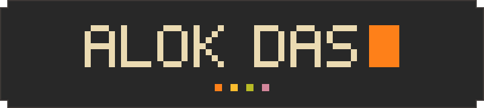
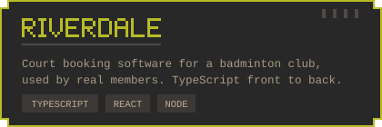
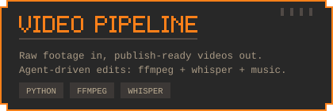
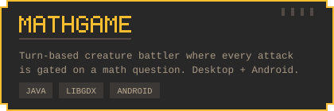
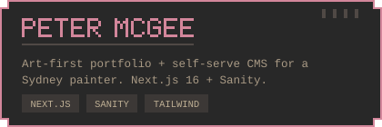

  

  <b>full-stack engineer · ai automation · games on the side</b>

  I build products end to end — front end, API, infra, and the automation around them. 
  Lately: a club booking platform, a CMS-backed artist portfolio, an agent-driven video pipeline.

 

— selected work —

  
  

  
  

 

  <code>typescript</code> <code>python</code> <code>react</code> <code>node</code> <code>godot</code> <code>libgdx</code> <code>ffmpeg</code>

 

  

  <a href="https://razer256g4.github.io">portfolio</a>

